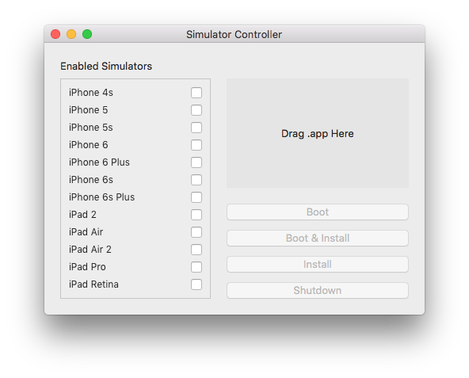

# Simulator Controller

A Mac OS X application that boots, installs and launches a .app on multiple iOS simulators.

Uses [FBSimulatorControl](https://github.com/facebook/FBSimulatorControl) to interface with the simulators.

## Installation

[Download the latest version here](https://github.com/davidlawson/SimulatorController/releases/download/v1.1/SimulatorController.app.zip).

## Usage

Drag your iOS application's .app from the Products folder in your Xcode project to Simulator Controller.

Select the simulators you want to launch, then press Boot or Boot & Install.

When you have made changes to your app, rebuild it then press Install to reinstall it on the simulators.

## Scripting Support

Add the following as a Run Script in your app's Build Phases:

    osascript -e "if application \"SimulatorController\" is running then tell application \"SimulatorController\" to install"

Whenever you build your app and the Simulator Controller has simulators booted, this will automatically install and launch the updated app.

## Tips

Some simulators do not support the x86_64 architecture. Disable "Build Active Architecture Only" in your Build Settings if you want to launch your app on both older and newer simulators.

## Building

Run `carthage bootstrap` to download and build the FBSimulatorControl framework.
